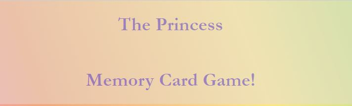

<h1 align="center">Princess Memory Card Game</h1>

[View the live project here.](https://shonaob.github.io/CIProject2/)

This game is aimed at children between the ages of 5 to 10 years old. The aim of the game is to uncover all the matching pairs of cards before you run out of "lives". It is a fun, slow paced game to help develop memory and dexterity skills!

<h2 align="center"></h2>

## User Experience (UX)

-   ### User stories

    -   #### First Time Visitor Goals

        1. As a First Time Visitor, I want the instructions to be easily understandable and easy to follow within the target age group
        2. As a First Time Visitor, I want the access to the main game to be intuitive and easy.
        3. As a First Time Visitor, I am not looking for any further information - with as little distraction as possible.

    -   #### Returning Visitor Goals

        1. As a Returning Visitor, I want consistency in how the site is displayed. 
        2. As a Returning Visitor, I may require the buttons and the styling to remain similar, should I have any literacy issues or sensory issues. 

    -   #### Frequent User Goals
        1. As a Frequent User, I want to check to see if there are any newly added levels in the game - this will be included in future versions of the game. 
        2. As a Frequent User, I want to see more rewards or a point system for frequent winning in the game - this will be included in future versions of the game. 

-   ### Design
    -   #### Colour Scheme
        -   The background on the site was initially a colourful gradient, however after testing with users it was found to be too distracting. A simple, single colour background was implemented instead.
    -   #### Typography
        -   The Garamond font family was first choice for this site for readability and also as the serif style suited the theme. Times New Roman is a backup.
    -   #### Imagery
        -   Imagery is limited to the cards themselves to avoid distractions. The images used are from various sources and intended only for use in this game (as a project).

*   ### Wireframes

    -   PC Wireframe - [Image](/workspace/CIProject2/assets/images/wireframepc.JPG)

    -   Mobile Wireframe - [Image](/workspace/CIProject2/assets/images/wireframemobile.JPG)

## Features

-   Responsive on all device sizes

-   Interactive elements

## Technologies Used

### Languages Used

-   [HTML5](https://en.wikipedia.org/wiki/HTML5)
-   [CSS3](https://en.wikipedia.org/wiki/Cascading_Style_Sheets)
-   [JavaScript](https://en.wikipedia.org/wiki/JavaScript)

### Frameworks, Libraries & Programs Used

1. [Git](https://github.com/ShonaOB/CIProject2)
    - Git was used for version control by utilizing the Gitpod terminal to commit to Git and Push to GitHub.
1. [GitHub:](https://github.com/ShonaOB/CIProject2)
    - GitHub is used to store the projects code after being pushed from Git.
1. [Balsamiq:](https://balsamiq.com/)
    - Balsamiq was used to create the [wireframes](https://github.com/ShonaOB/CIProject2) during the design process.

## Testing

The W3C Markup Validator and W3C CSS Validator Services were used to validate every page of the project to ensure there were no syntax errors in the project.

-   [W3C Markup Validator](https://jigsaw.w3.org/css-validator/#validate_by_input) - [Results](https://github.com/)
-   [W3C CSS Validator](https://jigsaw.w3.org/css-validator/#validate_by_input) - [Results](https://github.com/)
-   [JavaScript Validator](https://jigsaw.w3.org/css-validator/#validate_by_input) - [Results](https://github.com/)

### Testing User Stories from User Experience (UX) Section

-   #### First Time Visitor Goals

    1. As a First Time Visitor, I want the instructions to be easily understandable and easy to follow within the target age group

        1. Upon entering the site, users are automatically greeted with a clean and easily readable list of instructions. 
        2. The "Start" button is easily accessible for those within the age group, and the hover/colour change shows clearly when you are about to interact with it. 

    2. As a First Time Visitor, I want the access to the main game to be intuitive and easy.

        1. The game site is extremely simple with very little distraction. This allows the user to focus on the task at hand. 
        2. The "Lives" counter is familiar to users in this age bracket and very clear and understandable. 
        3. The only other button on the page is the button to return to the home screen. 

    3. As a First Time Visitor, I am not looking for any further information - with as little distraction as possible
        1. The minimal design of the site and the calm colour scheme provide very little distraction. 

-   #### Returning Visitor Goals

    1. As a Returning Visitor, I want consistency in how the site is displayed.

        1. The simple design and colour scheme allows the site to remain consistent for users. 

    2. As a Returning Visitor, I may require the buttons and the styling to remain similar, should I have any literacy issues or sensory issues. 

        1. The site is very simple without distracting adverts or other links to external sources. 
        2. The buttons are large and clear, with only two options (start and return home) to avoid confusion. 
-   #### Frequent User Goals

    1. . As a Frequent User, I want to check to see if there are any newly added levels in the game - this will be included in future versions of the game. 

        1. This will be included in future releases 

    2. As a Frequent User, I want to see more rewards or a point system for frequent winning in the game - this will be included in future versions of the game.

        1. This will be included in future releases 

### Further Testing

-   The Website was tested on Google Chrome, Internet Explorer, Microsoft Edge and Safari browsers.
-   The website was viewed on a variety of devices such as Desktop, Laptop, Samsung.
-   A large amount of testing was done to ensure that all pages were linking correctly.
-   Friends and family members were asked to review the site and documentation to point out any bugs and/or user experience issues.
-   Colleagues and friends on our Slack community were asked to test and report any issues. 

### Known Bugs

-   Some testers reported that the speed at which the cards rotate is too slow, however once reminded of the target audience, they agreed the speed was appropriate for the group. 
-   Some testers recommended that all cards be shown initially, for a couple of seconds, before the game starts. However this was not in the brief for this project. 

## Deployment

### GitHub Pages

The project was deployed to GitHub Pages using the following steps...

1. Log in to GitHub and locate the [GitHub Repository](https://github.com/ShonaOB/CIProject2)
2. At the top of the Repository (not top of page), locate the "Settings" Button on the menu.
    - Alternatively Click [Here](https://raw.githubusercontent.com/) for a GIF demonstrating the process starting from Step 2.
3. Scroll down the Settings page until you locate the "GitHub Pages" Section.
4. Under "Source", click the dropdown called "None" and select "Master Branch".
5. The page will automatically refresh.
6. Scroll back down through the page to locate the now published site [link](https://github.com) in the "GitHub Pages" section.

## Credits

### Code

-   Several online tutorials were helpful to me in creating this project: 
    - [DevEd] - (https://www.youtube.com/watch?v=-tlb4tv4mC4): Wonderful and speedy tutorial on memory games, and this tutorial was specifically useful in creating the grid for the cards. Also extremely helpful and inspiring to learn how to make my code more concise. 
    - [KodeBase] - (https://www.youtube.com/watch?v=43kJSL4sieE): hugely helpful in learning how to use the SweetAlert popup feature
    - [Inspiration] - (https://www.youtube.com/watch?v=u7vuewwPjfE&t=77s): inspiring games for similar projects!

-   [WC3 School Tutorials](https://www.w3schools.com/js/) : For all general queries, this was a wonderful resource. It was specifically helpful in implementing the gradients in the background and the time-out section of the code. 

### Content

-   All content was written by the developer.

### Media

-   All Images were located through Pinterest and remain the copyright of the original owners, as well as Disney.

### Acknowledgements

-   My Mentor for continuous helpful feedback.

-   Slack Community for their support and guidance.